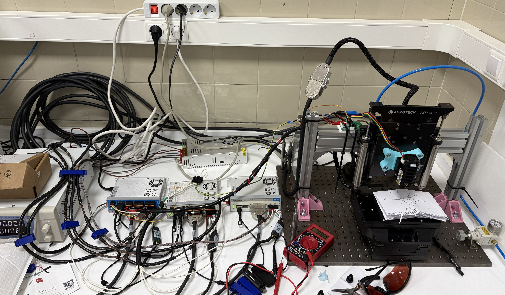

# LaserMotion GUI

Interfaz gráfica de escritorio (Python + PySide6) para controlar una estación láser de nanoposicionamiento sobre mesas Aerotech ANT130XY/ANT130LZS: movimiento manual de ejes, generación y ejecución de G-Code, disparo del láser (PSO) y configuración de la conexión con el controlador, todo desde un panel visual con distintos temas.

Para más información, consulta el manual de usuario.
📖 Manual de usuario: **https://whoische.github.io/LaserMotion_GUI/**
